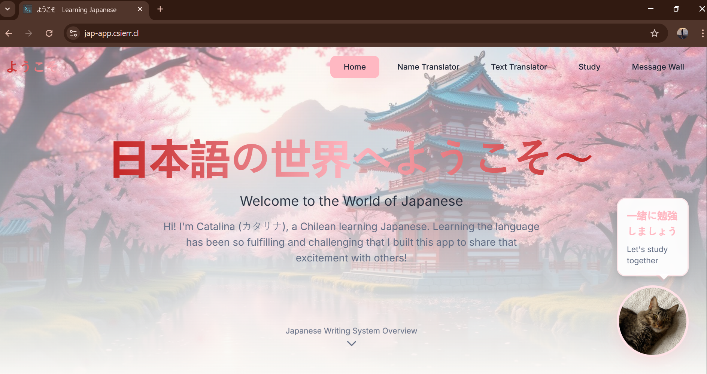

# Deployment Guide: Learning Japanese App

These are step-by-step instructions of how I deployed the app to an AWS EC2 instance using Docker Compose and exposed it to the web securely with a Cloudflare Tunnel.

## About This Deployment Configuration

This directory contains modified configuration files specifically for deployment. The original files in the project's root and `/backend` directories are intended for local development.

-   **`docker-compose.yml`**: This version includes the `cloudflare` service and a `command` for the backend to ensure it waits for the database.
-   **`Dockerfile`**: This is a modified version of the backend Dockerfile that installs necessary tools for the wait script.
-   **`wait-for-postgres.sh`**: A new script that pauses the backend container's startup until the database container is ready to accept connections.

When deploying, you will use the files from this `deployment` folder instead of the originals.


## Prerequisites

- AWS account.
- Cloudflare account.
- A domain name of your own.
- Git installed on your local machine.
- Terminal with SSH capabilities.

## Step 1: AWS EC2 Instance Setup

First, I created a virtual machine on AWS to host the application.

1.  **Launch EC2 Instance**:
    - Sign in to AWS Management Console and navigate to the EC2 service.
    - Click "Launch instance".
    - **Name**: A recognizable name (e.g., `my-app-server`).
    - **Application and OS Images (AMI)**: Select the image of your preference. I selected **Amazon Linux**, an example version is `al2023-ami-2023.9.20251105.0-kernel-6.1-x86_64`.
    - **Instance type**: I selected `t2.micro` (eligible for the AWS Free Tier).

2.  **Create Key Pair**:
    - In the "Key pair (login)" section, create a new key pair.
    - Give it a name (e.g., `my-app-key`) and download the `.pem` file.
    - **Important**: Store securely, as it's the way to access the instance.

3.  **Configure Network Security Group**:
    - In "Network settings", click "Edit".
    - Configure the **Inbound security groups rules** to allow traffic on the following ports:

| Type  | Protocol | Port Range | Source      | Description                  |
| :---- | :------- | :--------- | :---------- | :--------------------------- |
| SSH   | TCP      | 22         | `0.0.0.0/0` | For SSH access to the server |
| HTTP  | TCP      | 80         | `0.0.0.0/0` | For standard web traffic     |
| HTTPS | TCP      | 443        | `0.0.0.0/0` | For secure web traffic       |


4.  **Launch the Instance**:
    - Review the settings and click "Launch instance".

## Step 2: Connect and Prepare the Instance

1.  **Connect via SSH**:
    - Find the **Public IPv4 address** of the instance in the EC2 dashboard.
    - In your terminal and use the following command, replacing the placeholders with your key pair path and instance IP.
    ```bash
    ssh -i /path/to/your-key-pair.pem ec2-user@your_public_ip_address
    ```

2.  **Install Dependencies**:
    - Once connected, run the following commands to update the server and install Docker.
    ```bash
    # Update all packages
    sudo dnf update -y

    # Install Docker
    sudo dnf install docker -y

    # Start the Docker service
    sudo systemctl start docker

    # Add the ec2-user to the 'docker' group to run docker commands without sudo
    sudo usermod -aG docker ec2-user

    # Log out and log back in for the group change to take effect
    exit
    ```
    - After exiting, **reconnect using the same `ssh` command**.

3.  **Clone the Project**:
    - Install Git and clone the repository.
    ```bash
    sudo dnf install git -y
    git clone https://github.com/your-username/learning-japanese-app.git
    cd learning-japanese-app
    ```

## Step 3: Cloudflare Tunnel Configuration

I used a Cloudflare Tunnel to expose the application to the internet through a custom domain without opening extra ports.

1.  **Create a Tunnel in Cloudflare**:
    - Go to Cloudflare Dashboard.
    - On the left sidebar, navigate to **Zero Trust**.
    - Go to **Access > Tunnels**.
    - Click **"Create a tunnel"**. Choose `Cloudflared` as the connector type.
    - Give your tunnel a name (e.g., `my-app-tunnel`) and save it.

2.  **Get Your Tunnel Token**:
    - On the next screen, Cloudflare will provide a command to run the connector. This command contains a unique tunnel token. It will look something like this:
      `cloudflare/cloudflared:latest tunnel --no-autoupdate run --token <YOUR_TOKEN_HERE>`
    - **Copy only the token part**. It's a long string of random characters.

3.  **Update `docker-compose.yml`**:
    - On your EC2 instance, open the `docker-compose.yml` file.
    - Replace the placeholder `"your_token_here"` in the `cloudflare` service with the actual token you just copied.
    ```yaml
    # deployment/docker-compose.yml
    # ...
    cloudflare:
        container_name: cloudflare-jap-app
        image: cloudflare/cloudflared:latest
        command: ["tunnel", "--no-autoupdate", "run", "--token", "ey...your...long...token...here...=="]
    # ...
    ```

4.  **Route Traffic to Your App**:
    - Back in the Cloudflare dashboard, proceed to the next step ("Route traffic").
    - Create a **Public Hostname**.
      - **Subdomain**: Enter the name you want (e.g., `my-app`).
      - **Domain**: Select your domain (e.g., `mydomain.com`).
      - **Service Type**: `HTTP`
      - **Service URL**: `frontend-jap-app:80` (Name must match the `container_name` of the frontend service in `docker-compose.yml`).
    - Save the hostname. The app will now be accessible at `my-app.mydomain.com`.

## Step 4: Final Setup and Launch

1.  **Create Environment Files**:
    - Create the necessary `.env` files for the backend and frontend with the specific configurations (API keys, database credentials, etc.).
    ```bash
    # In the project root directory
    nano backend/.env
    nano frontend/.env
    ```

2.  **Build and Run the Application**:
    - From the project's root directory on tthe EC2 instance, run the following commands:
    ```bash
    # Build the images based on the Dockerfiles
    docker compose -f docker-compose.yml build

    # Start all services in detached mode
    docker compose -f docker-compose.yml up -d
    ```

3.  **Verify the Deployment**:
    - Check that all containers are running correctly.
    ```bash
    docker ps
    ```
    - You should see four containers running: `backend-jap-app`, `frontend-jap-app`, `db`, and `cloudflare-jap-app`.

You can now access the application by visiting the public hostname you configured in Cloudflare (e.g., `https://my-app.mydomain.com`).

## App in action!

